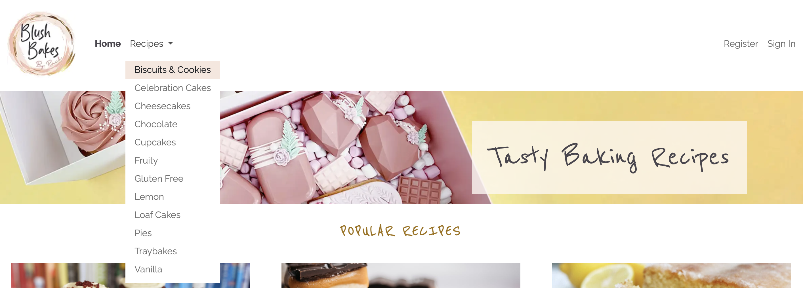
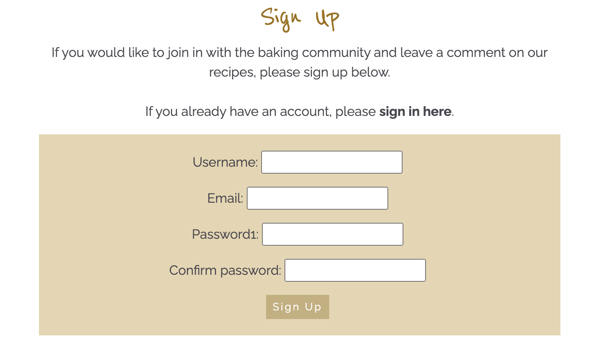

# BLUSH BAKES BY RACH | RECIPE BLOG

Welcome to the Recipe Blog by Blush Bakes by Rach. Utilising the existing branding and style from my business website, I've built this blog with a focus on elegant simplicity, wanting to share my baking passion with a wider audience.

Using a combination of HTML, CSS, JavaScript, and Python using the Django framework, this blog offers a responsive experience across all devices, whether on your desktop, tablet, or phone - the content is easy to navigate and visually appealing.

As a visitor to the site, you'll find a range of different baking recipes, ranging from cakes and cupcakes to biscuits and brownies. There is a link to register for an account, enabling you to engage with the community by commenting on recipes and sharing your own baking experiences.

One of the highlights of this blog is the ability to save your favourite recipes directly to your profile, giving easy access to the recipes later.

LIVE SITE

[You can view the live site here.](https://blush-bakes-blog-2f3197aab1bc.herokuapp.com/)

GITHUB PAGES

[You can view the GitHub code pages here.](https://github.com/rachaelbabister/blush-bakes-blog)

---

## CONTENTS

- [BLUSH BAKES BY RACH](#blush-bakes-by-rach)
  - [CONTENTS](#contents)
  - [User Experience (UX)](#user-experience-ux)
    - [User Stories](#user-stories)
      - [Client Goals](#client-goals)
      - [First Time Visitor Goals](#first-time-visitor-goals)
      - [Returning Visitor Goals](#returning-visitor-goals)
      - [Frequent Visitor Goals](#frequent-visitor-goals)
      - [Agile Methodology](#agile-methodology)
  - [Design](#design)
    - [Colour Scheme](#colour-scheme)
    - [Typography](#typography)
    - [Imagery](#imagery)
    - [Wireframes](#wireframes)
  - [Features](#features)
    - [General features on each page](#general-features-on-each-page)
      - [Home Page](#home-page)
      - [Gallery](#gallery)
      - [Contact](#contact)
      - [Thank You](#thank-you)
    - [Future Implementations](#future-implementations)
    - [Accessibility](#accessibility)
  - [Technologies Used](#technologies-used)
    - [Languages Used](#languages-used)
    - [Frameworks, Libraries \& Programs Used](#frameworks-libraries--programs-used)
    - [Deployment](#deployment)
    - [Local Development](#local-development)
      - [How to Fork](#how-to-fork)
      - [How to Clone](#how-to-clone)
  - [Testing](#testing)
  - [Credits](#credits)
    - [Code Used](#code-used)
    - [Content](#content)
    - [Media](#media)
    - [Acknowledgments](#acknowledgments)

---

## User Experience (UX)

### User Stories

Blush Bakes by Rach is a company run by cake artist, Rachael Babister. This website is dedicated to sharing delightful baking recipes, whether you're a seasoned baker or just starting out, you'll find an array of mouth-watering recipes for cakes, cupcakes, biscuits, brownies, and more. Rachael wants to share her recipes with the baking community, enabling users to comment and share their experiences with the recipes, as well as saving their favourites to their profile page to come back to them at a later date.

#### Client Goals

- To easily add new recipes to the blog to share with the baking community.
- To enable site visitors to comment on individual recipes and have these posted once approved.
- Site visitors to be able to create a profile and save their favourite recipes.
- For site visitors to be able to get in touch with Blush Bakes by Rach Recipe Blog with an enquiry.
- To easily navigate through the site on any device, whether a mobile phone or a desktop computer.

#### First Time Visitor Goals

- I want to see a good mix of different baking recipes I can make.
- I want to see what other people are saying about the recipes, any tips etc.
- I want to be able to add my own comments to a recipe.
- I want to be able to save my favourite recipes to my profile.
- I want to be able to search for recipes by category.
- I want to know if a recipe is easy to do.
- I want to be able to get in touch using a contact form.
- I want to find out more about the baking business on their Social Media pages.

#### Returning Visitor Goals

- I want to be able to login to my profile and view my saved recipes.
- I want to have a look at what other people have been saying about the recipes.
- I want to delete a previous comment I made.

#### Frequent Visitor Goals

- I want to see if there are any new recipes on the blog.
- I want to add more or delete favourite recipes to my profile.
- I want to amend the details of my profile.

### Agile Methodology

Before work started on the build of the website, I created a Board of User Stories to determine exactly what was needed. Using the MoSCoW method, it was much easier to implement each issue based on their priority rather than trying to get everything completed. My User Story Board can be viewed [here.](https://github.com/users/rachaelbabister/projects/3/views/1)

---
## Design

### Colour Scheme

The colour scheme for the website came from the colours that were used in the main Blush Bakes by Rach website.

### Typography

- Reenie Beenie: A cursive font used for headings throughout the website, offering a touch of elegance that resonates with the branding and logo aesthetics.
- Raleway: A clean sans-serif font, with good legibility for the main body text, giving a modern appearance for easy reading, enhancing the overall user experience. 

Font Awesome is also used for the 'back to top' arrow on the website and the comments icon.

### Imagery

The type of imagery used on the website is all photography. The logo was designed by me, and the main header photo was taken by myself. The recipe photos have been taken from Google search and are referenced in Credits.

### Wireframes

Before implementing the website, I created Wireframes for each page using Balsamiq. You can access them [here](readmefiles/images/wireframes).

### Data Models

Various data models were drawn out before creating the actual models, to serve as a blueprint for database design, helping with concepts and organisation of the structure of a database. 

#### Relationships:

#### Recipe Posts:
- User (OneToMany): Each recipe is written and posted by a user. This relationship indicates a OneToMany relationship, where one user can create multiple recipe posts, but each recipe post is associated with only one user.

#### Comments:
- Recipe Post (OneToMany): Comments are associated with recipe posts, following a OneToMany relationship. Each recipe post can have multiple comments, but each comment is linked to only one recipe post.
- User (OneToMany): Similarly, comments are posted by users, forming another OneToMany relationship. A user can write multiple comments, but each comment is attributed to only one user.

#### User Profile:
- User (OneToOne): Each user has a user profile, establishing a OneToOne relationship. This ensures that each user has a single profile, and vice versa.

#### Contact Page:
- User (ManyToOne): The contact page allows users to send messages via a form. This establishes a ManyToOne relationship with users, as multiple messages can be sent by different users, but each message is associated with only one user.

#### Category:
- Recipe Categories (ManyToMany): Recipe posts can belong to multiple categories, while each category can have multiple recipe posts. This establishes a ManyToMany relationship, allowing for flexible categorisation of recipes.

### Website Security

#### env.py File
- Storing sensitive information on a website is vital to keep your website safe. API keys and databases are stored in the env.py which is not included in version control to prevent exposure.

#### Defensive Programming
- Using secure coding techniques such as  and @login_required helps to restrict unauthorised actions on the site, ensuring certain functions are only seen by authorised users.

#### Input Validation
- A plus to using Django is utilising their built-in form validation framework. The system can check for existing users, required fields and password confirmation, triggering errors if anything doesn't meet the requirements.

#### User Feedback
- Flash messages are used to feedback to a user when a certain action has been processed - whether successful or not. The user has a much more improved experience, feeling confident they know the processes of what is happening with their actions on the site.

---

## Features

### General features 

- The site is easily navigated with recipes appearing on the home, so users can start choosing a recipe straight away. 
- A drop down menu features difference categories to choose a recipe based on flavour or type of bake.
- A user can register on the site to make comments on recipes and save their favourite recipes. 
- All pages show the branding of the company with a logo and styling to match. A responsive navigational bar is in a header at the top of the page.
- Social media links can be found in the footer, with links for Facebook & Instagram, along with a contact link. These are shown as icons.
- There is a 'back to top' button for longer pages in the bottom right corner, making it easier for users to scroll to the top of the page.

#### Home Page

- NAV BAR: Is the same on every page. Logo on the left with main page navigation just to the left, with account management links to the right of the page. These change when you are signed in so you can access your profile page or logout. There is also a category drop down menu under Recipes, which when you select one will only show recipes within that category.

- Header: Features the nav bar and a full width image strip and heading of 'Tasty Baking Recipes'.

- MAIN CONTENT: Features recipe posts with a small description underneath an image of the recipe. Users can see what the recipe is, a small excerpt, the difficulty rating, and who it was posted by and when. A user can click on the image or content of the recipe card to be taken to the full recipe page.

- PAGINATION: At the bottom of the recipe cards/links there are pagination buttons depending on how many pages there are and what page you are on. You can scroll forwards and backwards using these.

- FOOTER: A pink background banner stretching across the width of the site, with social media links and a copyright message.

#### User Account

- SIGN UP: Users can fill in their details to create a user profile on the website, in order to be able to make comments and add favourites.

- SIGN IN: Allows registered users to sign in and access features on the site.

- PROFILE PAGE: Users can access their profile page to view their favourite recipes and see their personal information. They also have the ability to delete the recipes listed in their favourites.

- FLASH MESSAGES: Users will get flash messages at the top of the main content (underneath the main header of the page), notifying them of an action that has taken place.

- SIGN OUT: Users can use the sign out button in the main nav bar to sign out of their account. They are asked to confirm if they would like to sign out, or return to the home page if they want to stay logged in.

#### Recipe Posts

- RECIPE HEADER: When a user clicks on a recipe from the home page, they get taken to a detailed page of that recipe. At the top is a larger image of the food, and the same details as on the recipe card - title, difficulty rating, excerpt and posted by and when. There is also a 'back to previous page' button, which will take the user back to the previous page they were on.

- RECIPE DETAILS: Underneath the image are the recipes ingredients and method. Some recipes may have information paragraphs from the author, and so to help with user accessibility, there is a Jump to Recipe button, so it auto scrolls to the actual recipe.

- HEART ICON: The heart icon in the top right of the recipe header enables users to add that recipe to their favourites. They can access them when they visit their profile page. A user is only able to see the heart when they are logged in.

- COMMENTS: Comments appear underneath the recipe details. Once a comment has been approved by admin, anyone can view the comments. When they are under approval, only the user who posted the comment can see it and is able to manage that comment with an edit or delete button. You can only make comments when you are logged in. If a user tries to delete a comment, they are asked to confirm and can cancel the delete should they wish.

#### Category View

- CATEGORIES: If a user wants to find a recipe by category, they can use the Recipe drop down menu on the main navigation bar. Once clicked, only the recipes under that category will show. To view all recipes again, they can click on Home or the logo which will also take you back to the home page.

### Future Implementations

- Update or delete a user profile. (I would've liked to have included this in this design iteration, but time didn't allow.)
- A contact form for users to get in touch. (I would've liked to have included this in this design iteration, but time didn't allow.)
- An About page to give the user more information about the blog and the company, with a link to the main Blush Bakes by Rach website.
- A star rating on the recipes for users to rate a recipe, and for other users to see what the star rating is.
- A toggle of metric/imperial measurements on each recipe.
- Instructional videos for users to follow along.
- A printable version of the recipe.
- Nutritional values for the recipes.
- The ability for a user to adjust ingredient quantities based on the size of the bake they want to do.
- Email subscription, with unsubscribe options too.
- A forgotten/reset password function.
- A search by keyword function.
- To be able to share the recipes on a user’s social media pages.

### Accessibility

I have tried to ensure the site has been made as accessible as possible by:

- Using semantic HTML.
- Using alt attributes on images where available.
- A responsive design.
- Using colour contrasts between the text and background.
- Readable fonts.
- User feedback where required.

---

## Technologies & Frameworks

### Main Technologies

- HTML & CSS - to create the structure and add styling to the site.
- JavaScript - for functionality.
- Django - a Python based framework for backend development.
- ElephantSQL - a Postgres database to store all data.

### Frameworks, Libraries & Programs Used

- Am I Responsive? - to showcase the website on different devices.
- Balsamiq - to create Wireframes.
- ChatGPT - to create a JSON file of all the recipes.
- Codeanywhere - cross platform cloud IDE to deploy workspace environment to Github.
- Cloudinary - cloud based storage for images.
- Font Awesome - to use icons on the website.
- Github - to store and display all files and assets for the website.
- Google Fonts - to import the fonts used on the website.
- Google Image Search - to find images for the recipes.
- Google Dev Tools - to troubleshoot, test and solve issues with any styling.
- Heroku - for hosting and deployment of the site.
- JSHint - to check JavaScript files for bugs.
- Lighthouse - to test the accessibility of the site.
- Lucid - to create my Data Models.
- Photoshop 2023 - to optimise images for the website.
- W3C Markup Validator - to check the source code of my html files for any bugs.
- W3C CSS Validator - to check the source code of my CSS file for any bugs.

### Deployment

#### Environment & Settings

- In your IDE open your env.py file or create one in the main directory if it hasn't been created for you.
- Having created your cloud-based database, add the DATABASE_URL value and a SECRET_KEY value to the env.py file.
- Open the settings.py file and import the env.py file and the DATABASE_URL and SECRETKEY file paths.
- Install Django and add to requirements.txt.
- Create your project.
- Add the STATIC files settings.
- Create a file called Procfile (with a capital P) in the main directory,
- For cloud-based image storage, add Cloudinary URL to env.py
- Add Cloudinary libraries to INSTALLED APPS.
- Add your IDE workspace and Heroku to ALLOWED_HOSTS.
- Make migrations and migrate.
- Before you add, commit & push your files to GitHub, ensure DEBUG is set to False in your settings.py file.

#### Deploying to Heroku

- Login or create an account on Heroku.com. Click 'New' and then 'Create New App'.
- Give your project a unique name and select a region, then click 'Create App'.
- Connect your Heroku project to your GitHub repository. Under deployment you can choose GitHub, find the relevant one and click 'Connect.
- Once connected, go to the Settings tab and click on 'Reveal Config Vars'. Add the environment key & value variables used above in your env.py file (CLOUDINARY_URL, DATABASE_URL & SECRET_KEY).
- Next add DISABLE_COLLECTSTATIC and add 1 if this is to be disabled to prevent errors, or 0 if the app is in a state where errors will not be generated.
- Click on Buildpack further down and click Add Buildpack to confirm Heroku buildpack is present.
- Navigate to the Deploy section, click on Github for the deployment method and confirm.
- Search for your repository name and click connect.
- At the bottom of the deploy section, make sure you are connected to the main branch and then click Deploy Branch.
- You can then view your live site.

### Local Development

#### How to Fork

To fork a repository on Github, follow these steps:

1. Log in to Github - or step up a new account.
2. Click on the repository name.
3. Click the Fork button in the top right corner.

#### How to Clone

To clone a repository on Github, follow these steps:

1. Log in to Github - or step up a new account.
2. Find or create your repository.
3. Click on the code button, select whether you would like to clone with HTTPS, SSH or GitHub CLI and copy the link shown.
4. Open the terminal in your code editor and change the current working directory to the location you want to use for the cloned directory.
5. Type 'git clone' into the terminal and paste the link you copied in step 3. Press enter.

- - -

## Testing

I continually tested the site throughout the build process and fixed any issues that didn't work straight away.

Testing and bug fixes can be found in the file below.
  
[TESTING.md file](TESTING.md)

---

## Credits

### Code Used / Help Resources

- [W3Schools](https://www.w3schools.com) - helped with JavaScript for scroll to top button.
- [Stack Overflow](https://stackoverflow.com/) & [Django](https://docs.djangoproject.com/) - help with form template amends.
- [DEV](https://dev.to/earthcomfy/django-user-profile-3hik) - help with linking a register page with a profile page.
- [YouTube](https://www.youtube.com/watch?v=S9-Bt1JgRjQ) - tutorial on category dropdown menu and pages.
- [Bootstrap](https://getbootstrap.com/docs/5.1/components/navbar/) - help with dropdown menus.
- [Publii](https://getpublii.com/blog/one-line-css-solution-to-prevent-anchor-links-from-scrolling-behind-a-sticky-header.html) - to help with scrolling issues for Jump to Recipe button.
- [Learn Django](https://learndjango.com/) - helped with many Django obstacles I bumped into along the way.
- Code Institute Slack Channel
- I also used the 'I Think Therefore I Blog walkthrough to help with some setup and coding.
- ChatGPT - to explain certain code and bugs I didn't understand.

### Content

The recipes were created by ChatGPT in the form of a JSON file for easy importing into the database, rather than hard coding all the recipe details in.

### Media

The logo was designed by myself, and the header strip photo was taken by me. Icons used on the site are Font Awesome.

#### Recipe Card Images

- [Arla Foods](https://www.arlafoods.co.uk/recipes/chocolate-brownies/) - Brownies
- [Baking with Granny](https://bakingwithgranny.co.uk/recipe/banana-loaf/) - Banana Bread
- [All Recipes](https://www.allrecipes.com/recipe/157877/vanilla-cupcake/) - Cupcakes
- [BBC Good Food](https://www.bbcgoodfood.com/recipes/classic-victoria-sandwich-recipe) - Victoria sponge
- [Kidspot](https://www.kidspot.com.au/kitchen/recipes/choc-chip-cookies-recipe/oz1txtz2) - Chocolate Chip Biscuits
- [realfood Tesco](https://realfood.tesco.com/recipes/spiced-apple-pie.html) - Apple Pie
- [realfood Tesco](https://realfood.tesco.com/recipes/vegan-chocolate-fudge-cake.html) - Fudge Cake
- [Taste](https://www.taste.com.au/recipes/new-york-cheesecake-3/94db8765-15d6-46c3-be3a-3a2aa119b5e6) - Cheesecake
- [Every Day Cooks](https://everydaycooks.co.uk/flapjack/) - Flapjacks
- [Cooking with my Kids](https://www.cookingwithmykids.co.uk/lemon-drizzle-cake/) - Lemon Drizzle
- [Baking Mad](https://www.bakingmad.com/recipes/millionaire-s-shortbread) - Millionaires Shortbread
- [My GF Guide](https://www.mygfguide.com/gluten-free-red-velvet-cupcakes/) - Red Velvet Cupcakes

  
### Acknowledgments

I wouldn't have been able to complete this project without the help of the Slack Community. Special mention to Craig Hudson who stayed up until 2am working through some code issues with me!

Code Institute Tutor Support: Sean helped me when my database messed up, and John helped sort my JavaScript/Bootstrap issues which had caused all sorts to stop working just at the point of getting close to submission.

Code Institue Student Support for their help and understanding when I needed an extension for this project due to personal life blocks.

To my friends, who I am constantly asking to check over my website when they have their stuff to do! 

And apologies to my daughters who have had to eat microwave meals all week whilst I get this project finished!