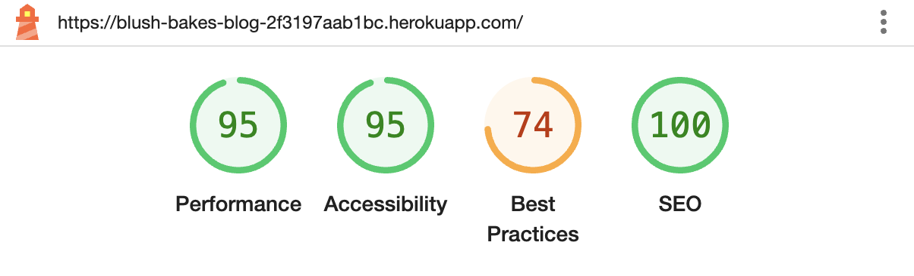
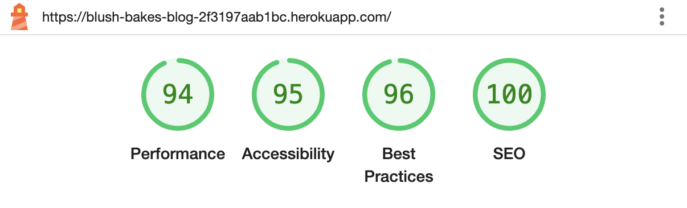
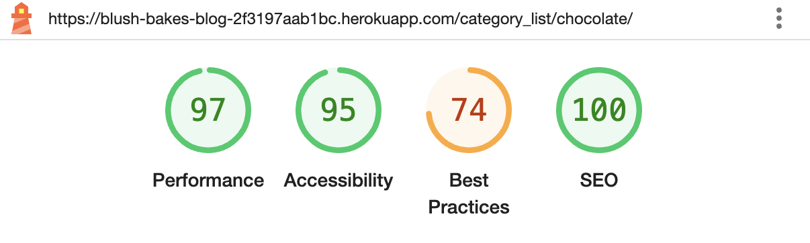
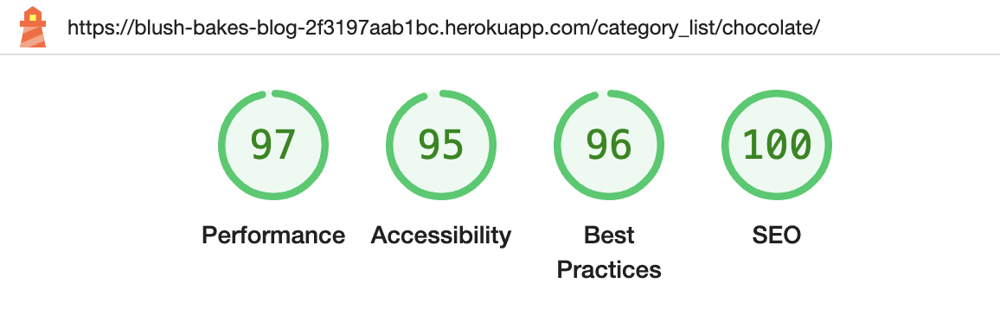
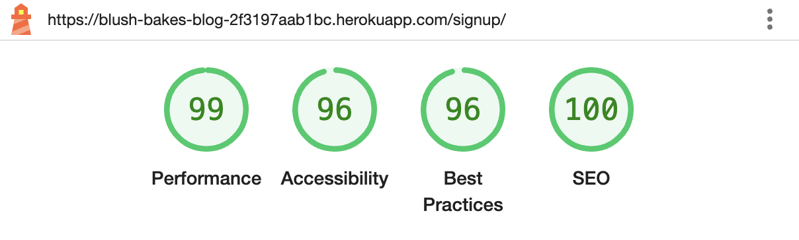
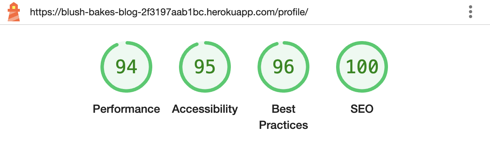
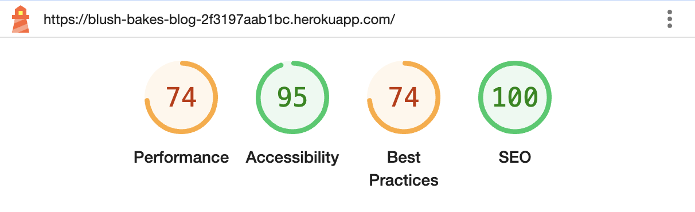
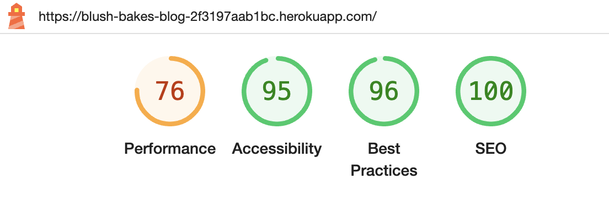
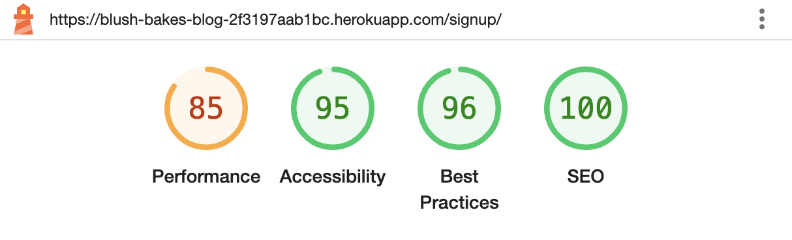
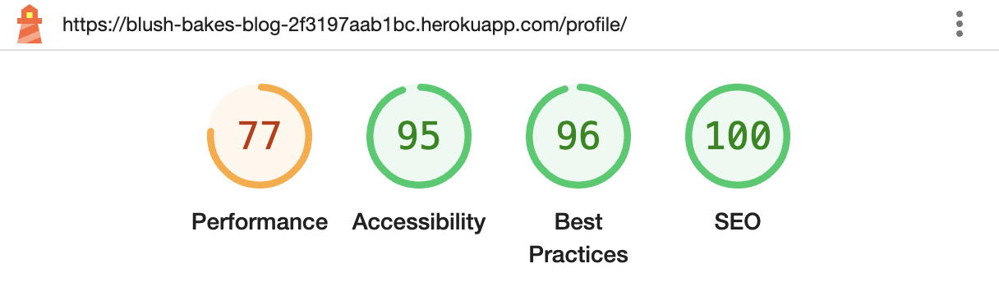

# BLUSH BAKES BY RACH BLOG - TESTING

LIVE SITE

[You can view the live site here.](https://blush-bakes-blog-2f3197aab1bc.herokuapp.com/)

## CONTENTS

- [BLUSH BAKES BY RACH - TESTING](#blush-bakes-by-rach---testing)
  - [CONTENTS](#contents)
  - [AUTOMATED TESTING](#automated-testing)
    - [W3C Validator](#w3c-validator)
    - [JSHint Validator](#jshint-validator)
    - [Lighthouse](#lighthouse)
      - [Desktop Results](#desktop-results)
      - [Mobile Results](#mobile-results)
  - [MANUAL TESTING](#manual-testing)
    - [Function Testing](#function-testing)

Testing was continually carried throughout the build process of this website. There were some User Stories that tested my own patience and resilience during this project (!), and required more fixing than others, which did mean that time didn't allow for other User Stories to get completed, eg. Contact page.

With that in mind, the site doesn't fully reflect what was built in the wireframes, but I'm pleased with how close it is.

Chrome Developer Tools has been extremely useful to bug the code and inform me where things may have been going wrong.

I used the W3C Validator to check my HTML and CSS source code, JSHint to check any JavaScript code, and also LightHouse within Chrome Developer Tools to test the performance and accessibility. These are explained in more detail below.

- - -

## AUTOMATED TESTING

### W3C Validator

[W3C](https://validator.w3.org/) was used to validate the source code for both the html and css on all pages of the website. Apart from the issues detailed below, there were no other errors or warnings to show.

- [Home page](readmefiles/images/testing/index-validator.png)
  - Not able to use an 'a' element as a child element of 'ul'. FIX - wrapped the 'a' within an 'li' element.
- Recipe Pages
- [Error 1](readmefiles/images/testing/recipepages-validator.png)
  - Elements 'h2', 'p' and 'hr' now allowed as a child element of 'span'. FIX - changed the 'span' element within recipe_detail.html to a 'div'.
- [Error 2](readmefiles/images/testing/recipepages-validator2.png)
  - Tag errors. FIX - change 'p' tag to a 'div' and remove stray 'div' end tag.
- [Category pages](readmefiles/images/testing/category-validator.png)
  - Trailing slash on void element. FIX - remove the trailing slash from 'hr'.
- [Logout page](readmefiles/images/testing/logout-validator.png) 
  - Not able to use 'button' element as a descendant of 'a' element. FIX - remove 'button' tag. 
- [CSS stylesheet](readmefiles/images/testing/css-validator.png)
  - Property 'justify' doesn't exist on .jump-button. FIX - .jump-button class was removed from stylesheet after reviewing it wasn't adding any style to the button, and the recipe_detail.html template was amended to remove any instances of the class.
  - Also a parse error. FIX - added a missing '}' bracket to the end of the stylesheet.

### JSHint Validator

- [script.js](readmefiles/images/testing/javascript-validator.png)
  - A missing semicolon - after reviewing the script file, I'm not sure where I would add a missing semicolon so this has been left.
  - Undefined and unused variables - these are used within the template pages of the site.

### Lighthouse

I used Lighthouse within the Chrome Developer Tools to test the performance, accessibility, best practices and SEO of the website.

#### Desktop Results

I came across some issues with Cloudinary causing low scores on Best Practices. I added in some code to ensure images were secure in my settings.py and when run again, this did improve the scores. Interestingly, when Lighthouse is run in incognito mode, the score improves on some pages. I have included both below.

- Home Page
  - Public

  - Incognito

- Recipes/Category
  - Public

  - Incognito

- Register page
  - Public  

- Profile page
  - Public  

#### Mobile Results

Unfortunately Performance had a low score on mobile results. Some the issues were to do with the Cloudinary images, and other images which could have a lower image size for mobile viewing. 

- Home
  - Public

  - Incognito

- Recipes/Category
  - Public

  - Incognito

- Register page
  - Public  

- Profile page
  - Public  

## MANUAL TESTING

### Function Testing

| Category                      | Features                                        | Expected Outcome                                                                                                                                                          | Testing Performed                                                                                               | Pass/Fail                             |
| ----------------------------- | ----------------------------------------------- | ------------------------------------------------------------------------------------------------------------------------------------------------------------------------- | --------------------------------------------------------------------------------------------------------------- | ------------------------------------- |
| Navbar                        | Logo link                                       | The logo should direct user back to the Home page, regardless of what page they are currently on.                                                                         | Clicked on logo.                                                                                                | Pass✅                                 |
|                               | Recipes                                         | Each recipe category should show recipes only within that category.                                                                                                       | Clicked on each category.                                                                                       | Pass✅                                 |
|                               | Register                                        | Should take you to a sign up page to enter details in order to create an account.                                                                                         | Clicked link.                                                                                                   | Pass✅                                 |
|                               | Sign In and Sign out                            | Sign in form should log a user in.                                                                                                                                        | Clicked link.                                                                                                   | Pass✅                                 |
|                               | Profile                                         | Once logged in this should show a users profile with the details they filled in when registering, and also any favourite recipes they have saved.                         | Clicked and saw profile information. Added a recipe to favourites.                                              | Pass✅                                 |
|                               | Responsiveness                                  | The website is fully responsive on different screen sizes and devices.                                                                                                    | Viewed the site on a laptop and mobile phone. Used Google Chrome Developer Tools to check other responsiveness. | Pass✅                                 |
| Register / Sign In / Sign Out | Check if username / password are correct or not | If a username has already been used, or if a user inserts incorrect information, they will get an alert to notify them.                                                   | Tried registering with a username already registered, and tried signing in with the wrong password.             | Pass✅                                 |
|                               | Confirm password                                | Passwords should match when registering and be a certain length. The user will get an alert if they don't match.                                                          | Tried a short password and mismatched passwords.                                                                | Pass✅                                 |
|                               | Registering                                     | When a user registers they will get alerted it has been successful and their profile page will be available to view.                                                      | Filled in the sign up form and received an alert it was successful.                                             | Pass✅                                 |
|                               | Signing In                                      | A username and password must match a previously registered account.                                                                                                       | Tried logging in with wrong details and got an alert.                                                           | Pass✅                                 |
|                               | Signing Out                                     | Once clicked, it should confirm the user is sure they want to, or they can return to the home page and stay logged in. Will also alert that sign out has been successful. | Clicked on sign out. Both buttons of sign out and return to home page were clicked.                             | Pass✅                                 |
| Comments                      | Add a comment                                   | A users comment should appear to the logged in user only, and will only appear when approved by admin. An alert will show informing them of this.                         | Added a comment and clicked submit.                                                                             | Pass✅                                 |
|                               | Edit a comment                                  | A logged in user should be able to edit their comment, whether it's been approved or not. The comment will updated once clicked on Edit.                                  | Tried editing both an approved comment and an unapproved one.                                                   | Pass✅                                 |
|                               | Delete a comment                                | A logged in user should be able to delete their comment, whether approved or not. They will get an alert notifying if successful and the comment will be removed.         | Deleted both an approved commment and an unapproved one.                                                        | Pass✅                                 |
| Pagination                    | Next & Prev                                     | Users should be taken to the next page or the previous page.                                                                                                              | Both buttons clicked.                                                                                           | Pass✅                                 |
|                               | Back to previous page                           | Users should be taken to the page they were previously viewing.                                                                                                           | Button clicked.                                                                                                 | Pass✅                                 |
|                               | Jump to Recipe                                  | The page should scroll to the start of the recipe ingredients section of the recipe page.                                                                                 | Button clicked.                                                                                                 | Pass✅                                 |
|                               | Back to top                                     | The page should scroll to the top of the page.                                                                                                                            | Button clicked.                                                                                                 | Pass✅ NB. Not appearing on home page. |
| Footer                        | Social Media Links                              | Footer social media links should take you to the relevant page of the companies socials.                                                                                  | Clicked on icons.                                                                                               | Pass✅                                 |
|                               | Contact                                         | Contact icon should allow the user to send an email.                                                                                                                      | Clicked on icon.                                                                                                | Pass✅                                 |
