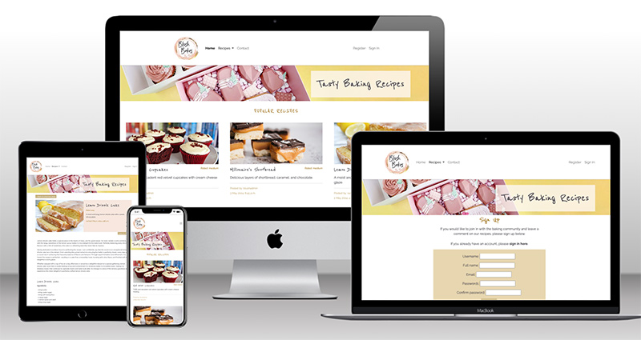

# BLUSH BAKES BY RACH BLOG - TESTING

LIVE SITE

[You can view the live site here.](https://blush-bakes-blog-2f3197aab1bc.herokuapp.com/)

## CONTENTS

- [BLUSH BAKES BY RACH - TESTING](#blush-bakes-by-rach---testing)
  - [CONTENTS](#contents)
  - [AUTOMATED TESTING](#automated-testing)
    - [W3C Validator](#w3c-validator)
    - [Lighthouse](#lighthouse)
    - [Desktop Results](#desktop-results)
    - [Mobile Results](#mobile-results)

Testing was continually carried throughout the build process of this website. There were some User Stories that tested my own patience and resilience during this project (!), and required more fixing than others, which did mean that time didn't allow for other User Stories to get completed, eg. Contact page.

With that in mind, the site doesn't fully reflect what was built in the wireframes, but I'm pleased with how close it is.

Chrome Developer Tools has been extremely useful to bug the code and inform me where things may have been going wrong.

I used the W3C Validator to check my HTML and CSS source code, JSHint to check any JavaScript code, CI Python Linter for Python code, and also LightHouse within Chrome Developer Tools to test the performance and accessibility. These are explained in more detail below.

- - -

## AUTOMATED TESTING

### W3C Validator

[W3C](https://validator.w3.org/) was used to validate the source code for both the html and css on all pages of the website. 

- [index.html](readmefiles/images/testing/index-validator.png)
  - Not able to use an 'a' element as a child element of 'ul'. FIX - wrapped the 'a' within an 'li' element.
- [gallery.html](assets/images/readme-images/gallery-validator.png)
  - Logo image tag was changed to img.
  - Button code was amended.
  - Changed sections to divs.
  - Removed aria-label
- [contact.html](assets/images/readme-images/contact-validator.png)
  - Logo image tag was changed to img.
  - Sections were changed to divs.
- [thankyou.html](assets/images/readme-images/thankyou-validator.png) 
  - Logo image tag was changed to img.
  - Sections were changed to divs.
- style.css 
  - No screenshot, however there was a missing curly bracket, and a parse error with a display:block class that wasn't related to anything. This was removed.

- - -

### Lighthouse

I used Lighthouse within the Chrome Developer Tools to test the performance, accessibility, best practices and SEO of the website.

### Desktop Results

Desktop results had good high figures - all in the green. Happy to see Accessibility is 100.

- index.html
  

- gallery.html
  

- contact.html
  

- thankyou.html
  

### Mobile Results

The accessibility on the index page came out lower than hoped, but this check was taken before the above validator bugs were fixed.

- index.html
  

The results after the bugs and errors had all been fixed were as follows:

- index.html
  

- gallery.html
  

- contact.html
  

- thankyou.html
  
